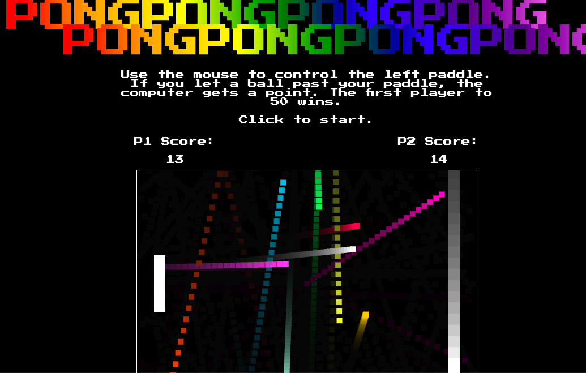

# PONGPONGPONGPONGPONGPONGPONGPONG

### Background

[PONGPONGPONGPONGPONGPONGPONGPONG Live](https://www.davidanderson.nyc/pongpongpongpongpongpongpongpong)



PONGPONGPONGPONGPONGPONGPONGPONG (hereafter PONG^8) is the classic PONG game but with way more PONG. A player and a computer are served 10 balls; the balls are served in different directions and with different speeds. When the player gets a ball past the computer player, the player is awarded a point. The first player to 50 points wins. 

### Technologies

PONG^8 implements the following technologies:

- `JavaScript`
- `HTML Canvas`
- `CSS5`

Balls are served at a random speed and a direction with the function `returnRandomSpeed`:

```javascript
returnRandomSpeed() {
    return ((Math.random() * 200) + 50) * (Math.random() > 0.5 ? 1 : -1);
}
```
`returnRandomSpeed` is run for both the x velocity and y velocity of each ball; the ternary at the end of the function determines if the ball is served left and/or up (negative) or right and/or down (positive). 

The AI computer player is written to be competitive but not infalliable. The position for the computer player is updated via the function `changeAIPos`:

```javascript
changeAIPos(ball) {
    this.players[1].pos.y = (this.players[1].pos.y + ball.pos.y)/2;
}
```

The y cordinate of the computer player (`this.players[1]`—the human player and the computer player exist in an array of players) is an average the computer's current y position and the y position of a specified ball. The ball argument is given to the `changeAIPos` function in the `update` function: 

```javascript
update(changeTime) {
    let chasingBall = this.balls[0];
    this.balls.forEach(ball => {
        if ((ball.velocity.x > 220 && ball.velocity.x < 350) || (ball.pos.x > chasingBall.pos.x && ball.velocity.x < chasingBall.velocity.x)) {
            chasingBall = ball;
        }
    // Additional work for each ball, including changing position and updating score. 
    }
    this.changeAIPos(chasingBall);
    // ... 
    this.draw();
}
```

Each time the `update` function is called, the `balls` array is iterated over. If the examined ball has an x velocity between 220 and 350, this ball becomes the chased ball; if the ball has an x velocity not in that range, but has an x velocity less than the current chased ball and a closer x position than the current chased ball, this ball becomes the chased ball. This allows for a computer player that will chase fast balls at the expense of close balls, but one that cannot chase balls that are too fast.  

### Artistic credits

PONG^8 was inspired by Pong, originally manufactored by Atari and released in 1972. Page font is [Press Start P2](https://fonts.google.com/specimen/Press+Start+2P). Favicon and pixel icon from [123RF](https://www.123rf.com/photo_85997350_stock-vector-pixel-pattern-vector-seamless-pixel-art-background-with-gray-silver-and-white-squares.html).