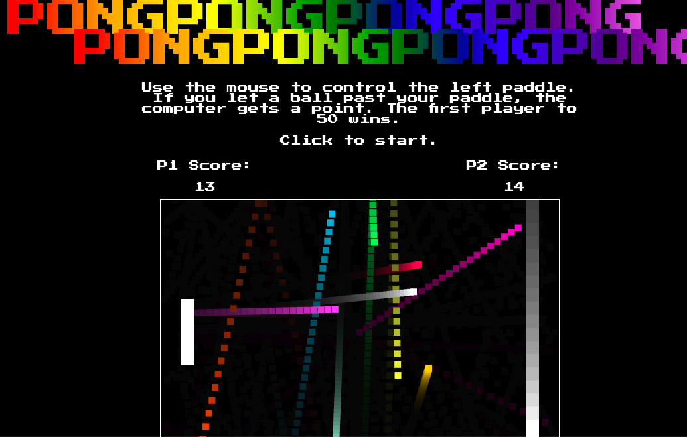

# PONGPONGPONGPONGPONGPONGPONGPONG

### Background

[PONGPONGPONGPONGPONGPONGPONGPONG Live](https://www.davidanderson.nyc/pongpongpongpongpongpongpongpong)

PONGPONGPONGPONGPONGPONGPONGPONG (hereafter PONG^8) is the classic PONG game but with way more PONG. A player and a computer are served 10 balls; the balls are served in different directions and with different speeds. When the player gets a ball past the computer player, the player is awarded a point. The first player to 50 points wins. 

### Technologies

PONG^8 implements the following technologies:

- `JavaScript`
- `HTML Canvas`

### Artistic credits

PONG^8 was inspired by Pong, originally manufactored by Atari and released in 1972. Page font is [Press Start P2](https://fonts.google.com/specimen/Press+Start+2P). Favicon and pixel icon from [123RF](https://www.123rf.com/photo_85997350_stock-vector-pixel-pattern-vector-seamless-pixel-art-background-with-gray-silver-and-white-squares.html).